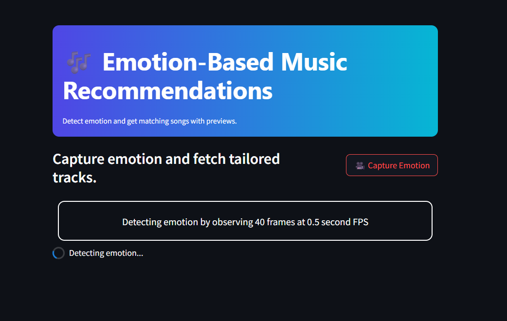
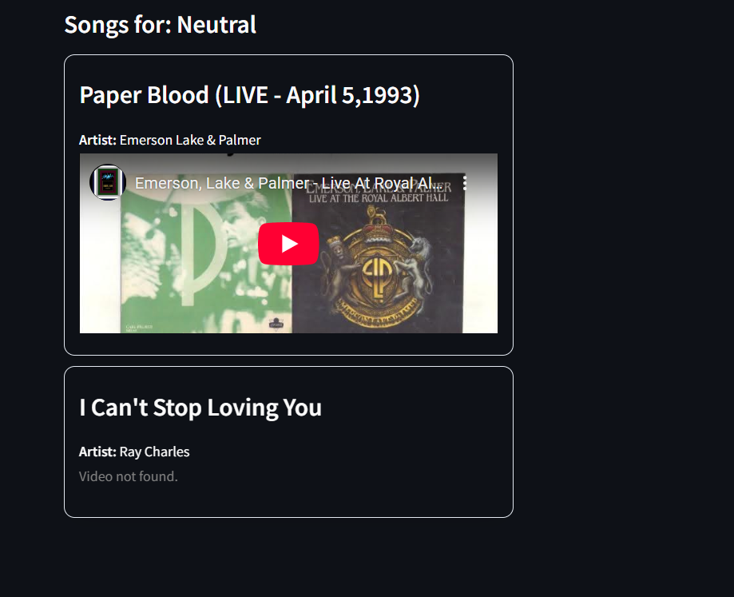

# 🎵 Emotion-Based Music Recommendation System

- 📷 **Captures 40 frames** spaced at 0.5-second intervals (~20 seconds total).
- 🤖 Detects emotions using a CNN model trained on the FER-2013 dataset.
- 🔝 Extracts the **top 2 emotions** from the detected set.
- 🎧 Recommends **5 personalized songs for each emotion**.
- 🧠 **Emotion-to-music mapping** using mood vectors:
  - Each emotion is mapped to a range of music attributes like tempo, energy, valence, etc.
  - A **randomized vector** is generated within the defined range for each mood to simulate natural variance.
  - This helps in better aligning the song characteristics with the detected emotion.


---

## 📁 Project Structure
```bash
EMOTION BASED RECOMMENDATION/
│
├── app.py # Main Streamlit app
├── requirements.txt # Required packages
├── dataset/
│ └── ClassicHit.csv # Song dataset
├── notebook/
│ └── recomendation_system.ipynb # Development notebook
├── src/
│ ├── emotion_detection/
│ │ ├── dataset_loader.py # Data preprocessing logic
│ │ ├── predict.py # Emotion prediction logic
│ │ └── train.py # Model training (FER-2013)
│ ├── model/
│ │ └── fast_emotion_model.h5 # Trained emotion model
│ └── music/
│ ├── get_songs.py # Song recommendation logic
│ └── moods.py # Emotion-to-mood mapping
```

---

## 🚀 How It Works

1. **Capture Frames**: 
   - The app captures 40 frames from the webcam (1 every 0.5 seconds).
   
2. **Emotion Detection**:
   - A CNN model trained on the [FER2013](https://www.kaggle.com/datasets/msambare/fer2013) dataset predicts emotion for each frame.
   - Top 2 emotions are selected based on frequency or confidence.

3. **Music Recommendation**:
   - Each emotion maps to certain ranges of song attributes (like energy, valence, dancebility, etc.).
   - A randomized mood vector is created within those ranges.
   - The recommender selects 5 songs per emotion matching these mood vectors.

A randomized mood vector is created within those ranges.

The recommender selects 5 songs per emotion matching these mood vectors.
---

## 🖼️ Sample UI

### 📌 App Interface


### 😊 Recommendations for Emotion 1


### 😢 Recommendations for Emotion 2


---

## 🔧 Installation

1. Clone the repository:
   ```bash
   git clone https://github.com/yourusername/emotion-music-recommendation.git
   cd emotion-music-recommendation
    ```
2. Install dependencies:
    ```bash
    pip install -r requirements.txt
    ```
3. Run the app:
    ```bash
    streamlit run app.py
    ```
## 📦 Dataset Used
- FER2013 for emotion detection training.
- ClassicHit.csv for mapping emotions to songs.

## 🧠 Model
- Trained using a CNN on FER2013.
- Saved in src/model/fast_emotion_model.h5.

## 🤝 Contribution
Feel free to fork the project, improve the model or UI, and create a pull request!

## 📃 License
MIT License